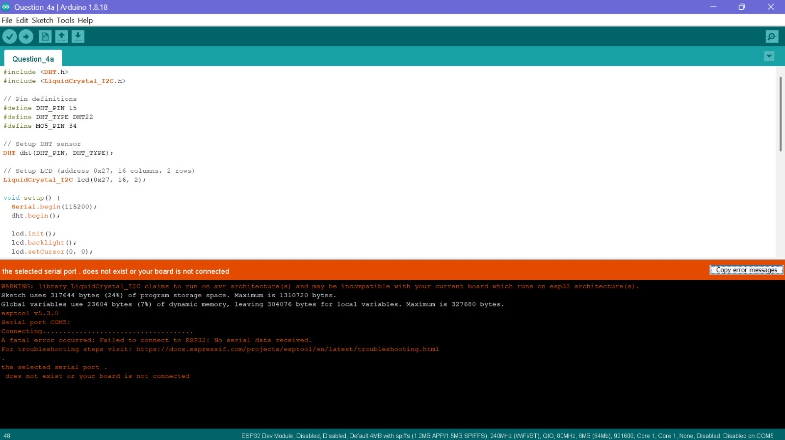
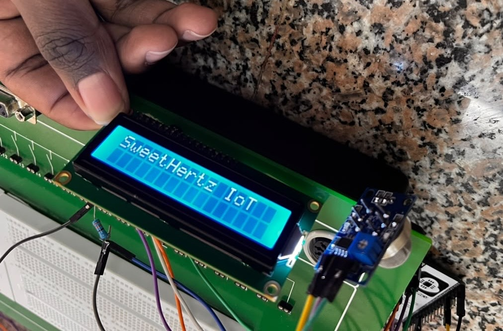
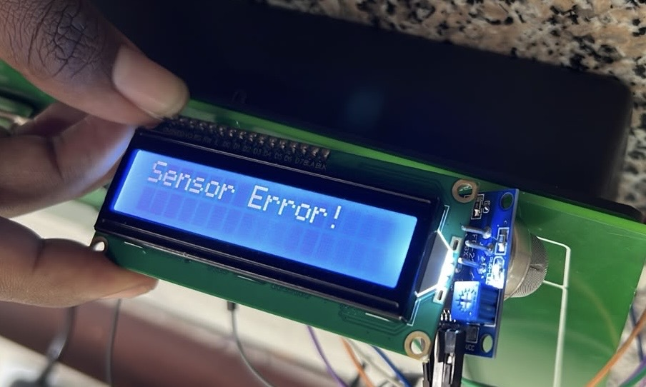
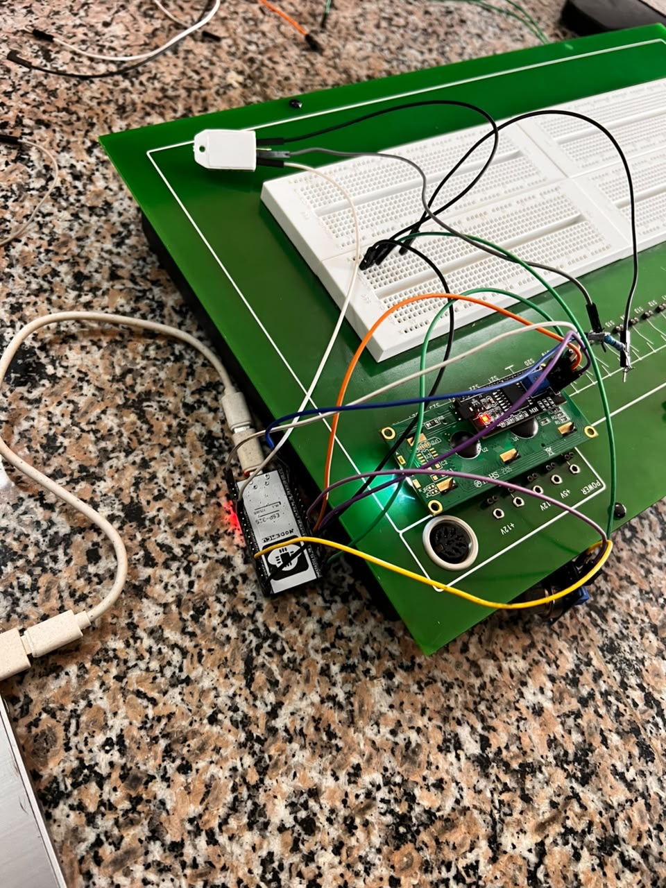
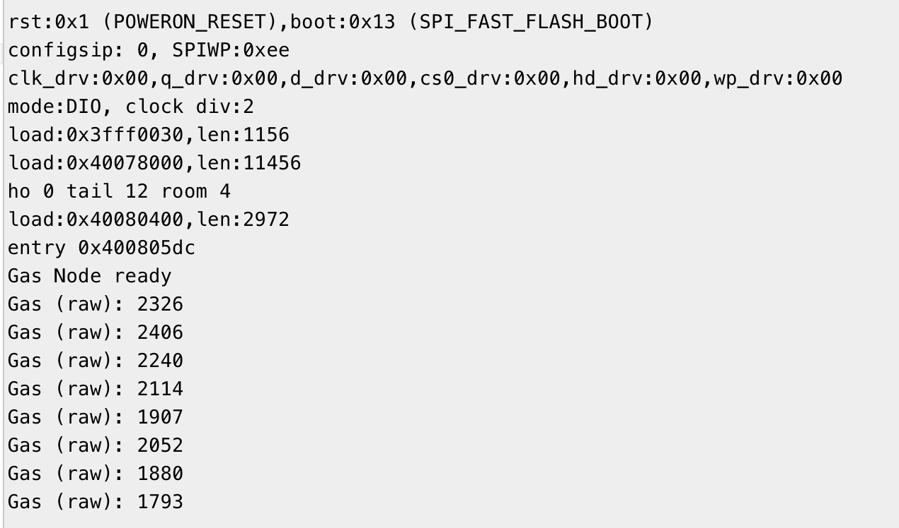
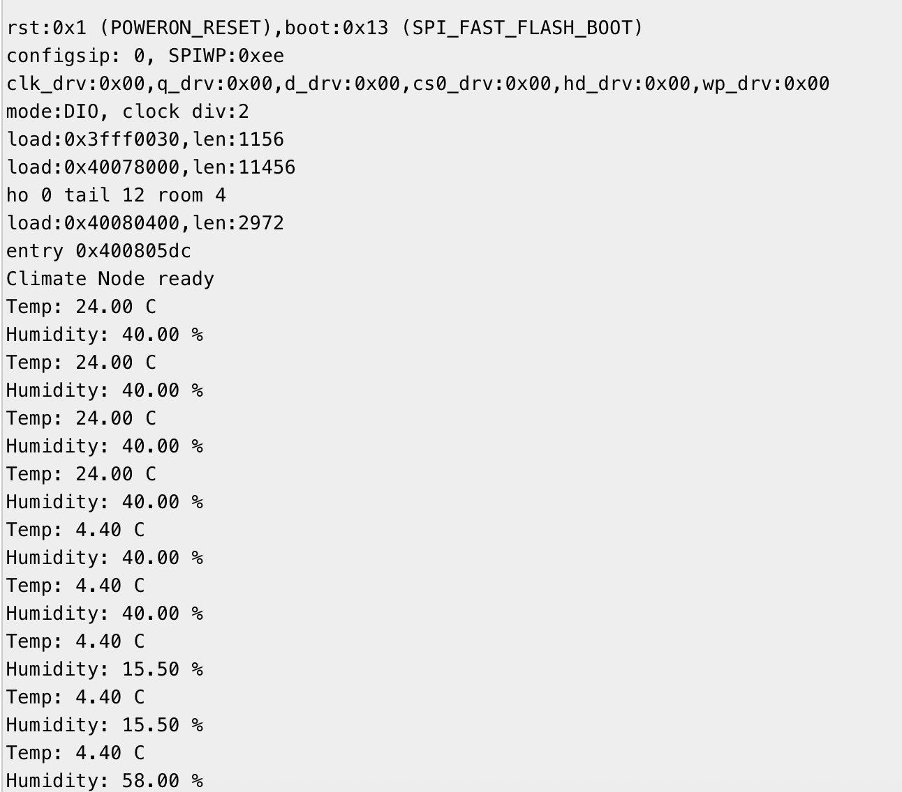
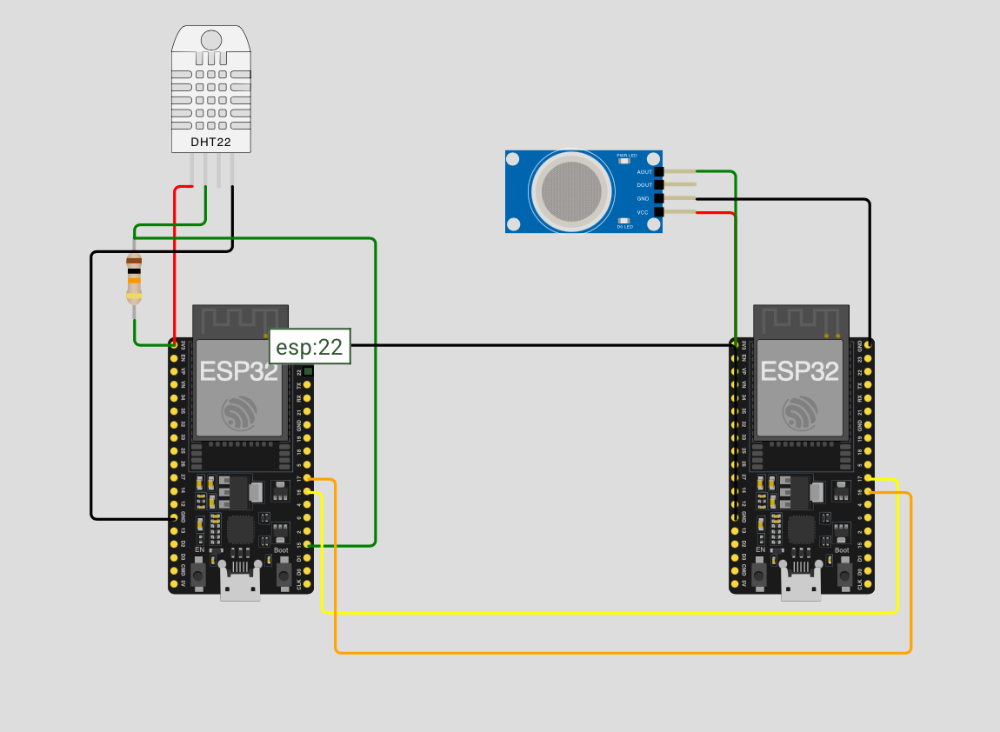
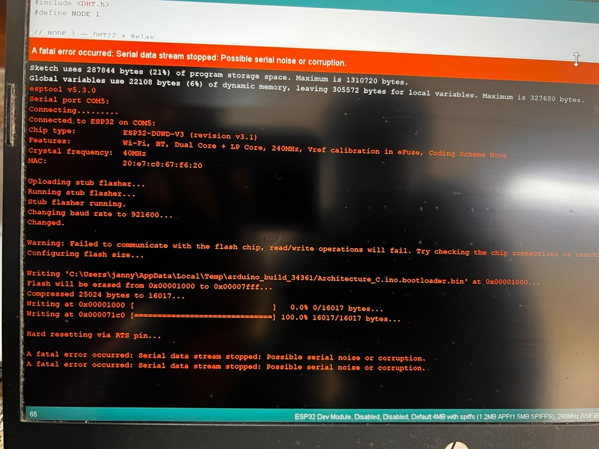
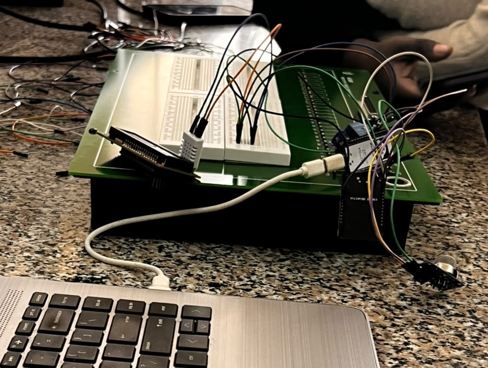

# Semester Project: Deliverable 2

**Objective:** Develop physical and simulated prototypes of the embedded device architectures defined in Deliverable 1.

This document covers the prototyping results for all three architectures.

| Architecture | Physical Prototype | Simulated Prototype |
|---|---|---|
| (a) ESP32 + MQ-5 + DHT22 + LCD | Attempted | Working |
| (b) ESP32 (MQ-5) to ESP32 (DHT22) via UART | - | Working |
| (c) ESP32 (DHT22) to Relay to ESP32 (MQ-5) | Attempted | Working |

As per the assignment instructions, Architecture (a) was built as both a physical and simulated prototype, while Architectures (b) and (c) were developed as an interchangeable pair. The team built Architecture (c) physically and simulated Architecture (b); a full simulation of Architecture (c) was also completed for verification and documentation purposes.

---

## Architecture (a): ESP32 + MQ-5 + DHT22 + LCD

### Simulation

**Status:** Working

**Wokwi Link:** [https://wokwi.com/projects/467656587195587585](https://wokwi.com/projects/467656587195587585)

The simulation ran successfully, with the LCD correctly displaying temperature, humidity, and gas sensor readings, and matching output visible on the Serial Monitor.

### Physical Prototype

**Status:** Partially working - hardware issue encountered

**What worked:**
- After installing the required libraries (`DHT sensor library`, `LiquidCrystal I2C`), the code successfully compiled and uploaded to the ESP32.
- The LCD initialized correctly and displayed the startup message "SweetHertz IoT" (see evidence below).

**The issue:**
- Shortly after startup, the LCD began displaying "Sensor Error!", indicating the DHT22 was not returning valid temperature/humidity readings (the `isnan()` check in the code was failing).
- This contradicts the simulation, where the same logic produced consistent, valid sensor readings.

**Troubleshooting attempted:**
- Reinstalled the ESP32 board drivers and re-verified board/port selection in Arduino IDE.
- Physically rebuilt the DHT22 wiring and pull-up resistor connection on the breadboard.
- Re-flashed the firmware multiple times to rule out a corrupted upload.

**Conclusion:**
After ruling out software/library issues and confirming the wiring matched the schematic from Deliverable 1, the team concluded this was most likely a hardware fault: either a faulty DHT22 unit or a marginal physical connection such as a loose pull-up resistor or breadboard contact not visible during inspection.

**Recommendation:**
Swap the DHT22 unit with a second unit to confirm whether the issue is sensor-specific, and test a different pull-up resistor value to confirm signal integrity on physical hardware before the next deliverable.

| Step | Evidence |
|---|---|
| Arduino IDE compile/upload |  |
| LCD startup message |  |
| LCD sensor error |  |
| Physical circuit attempt |  |

---

## Architecture (b): ESP32 (MQ-5/MQ2) and ESP32 (DHT22) via UART

### Simulation

**Status:** Working (with a documented platform limitation)

**Wokwi Link:** [https://wokwi.com/projects/467659080133756929](https://wokwi.com/projects/467659080133756929)

### Platform Limitation Encountered

Wokwi's web-based simulator does not support running two independent firmware images simultaneously on two separate MCUs within a single project. Only one compiled sketch can be active across the whole diagram at a time. This meant a single `sketch.ino` could not have ESP32 #1 running Gas Node logic while ESP32 #2 simultaneously ran Climate Node logic, even though both boards and all sensors were correctly wired in the same diagram.

### Solution

To work around this limitation while still demonstrating both roles within one project, the team used a conditional compilation flag in the shared sketch:

```cpp
#define NODE 1   // or 2
```

- Setting `NODE` to `1` compiles only the **Gas Node** logic (reads the MQ2, transmits data over UART/Serial2).
- Setting `NODE` to `2` compiles only the **Climate Node** logic (reads the DHT22, listens for incoming UART data, prints to Serial Monitor).

The team ran the simulation twice, once with each `NODE` value, to verify that both roles functioned correctly with their respective sensors, confirming the wiring and individual logic for each node was correct, even though true simultaneous dual-MCU execution is not possible on Wokwi's web platform.

### Results

- **NODE 1 (Gas Node):** Successfully read and transmitted MQ2 analog gas values.
- **NODE 2 (Climate Node):** Successfully read DHT22 temperature/humidity values.

| Output | Evidence |
|---|---|
| NODE 1 - Gas Node serial output |  |
| NODE 2 - Climate Node serial output |  |
| Simulation circuit |  |

### Note on Alternative Approaches Explored

The team also explored Wokwi's VS Code extension with a `wokwi.toml` configuration, which does support flashing genuinely separate compiled binaries to each MCU. This requires compiling each node's firmware independently via Arduino IDE and referencing the resulting `.bin` files in `wokwi.toml`. Initial setup was attempted but not completed in time for this deliverable; it is noted here as a recommended approach for true simultaneous multi-MCU simulation in future work.

---

## Architecture (c): ESP32 (DHT22) to Relay to ESP32 (MQ-5/MQ2)

### Simulation

**Status:** Working

**Wokwi Link:** [https://wokwi.com/projects/468142847060965377](https://wokwi.com/projects/468142847060965377)

The simulation ran successfully. ESP32 #1 read the DHT22 and triggered the relay based on a temperature threshold, while ESP32 #2 independently read the MQ2 gas sensor.

### Physical Prototype

**Status:** Did not work - code never successfully uploaded

**Hardware constraint:**
Due to limited lab resources, the lab technician was unable to provide two identical ESP32 boards as used in the simulation. The team instead had to use two visibly different ESP32 variants:

- **ESP32 Node:** featured 3 ground pins and a visible status LED indicating power/connection state.
- **ESP32 Dev Kit:** featured only 2 ground pins and no status LED.

This pin-count and behavioural mismatch suggests the two boards were different revisions or manufacturer variants, which may not have matched the pin layout assumed by the Wokwi simulation's board footprint.

**The issue:**
Across multiple upload attempts on both boards, the team consistently encountered:

```
A fatal error occurred: Serial data stream stopped: Possible serial noise or corruption.
```

This occurred during the flashing stage (after "Hard resetting via RTS pin..."), before any application code could run. The failure was therefore at the upload/communication level, not a sensor-reading issue.

**Troubleshooting attempted:**
- Verified COM port selection and driver installation.
- Re-checked all physical wiring against the schematic.
- Re-seated all breadboard connections.
- Replaced the lab-provided USB cable with the team's own cable, after determining the original was non-functional.
- Attempted uploads on both ESP32 variants; neither succeeded at any point.

**Suspected causes:**

1. **Faulty or low-quality USB cable initially used:** confirmed as one contributing factor, since the lab-provided cable did not work at all and had to be replaced.
2. **Board variant mismatch:** the differing pin layouts and behaviour (ground pin count, status LED) between the two ESP32 boards suggest they may not be fully equivalent to the `ESP32-DevKitC-V4` footprint used in the Wokwi simulation, which could affect both wiring accuracy and serial communication reliability.
3. **Possible faulty DHT22 unit:** since this circuit reused the same DHT22 sensor from Architecture (a), which also failed at runtime with a "Sensor Error!", there is a reasonable possibility this specific DHT22 unit is defective. This could not be confirmed here, however, since the upload itself failed before any sensor code could execute.

**Recommendation:**
- Request matching ESP32 board models for future multi-MCU physical builds, to eliminate pin-layout mismatch as a variable.
- Test each ESP32 board individually with a minimal "Hello World" sketch before wiring any sensors, to confirm board/upload reliability first.
- Test the DHT22 unit independently in a simple standalone sketch to confirm or rule out whether it is the source of repeated sensor issues across architectures.
- Always test the USB cable with a simple upload before beginning circuit assembly, to rule out cable faults early.

| Step | Evidence |
|---|---|
| Upload error |  |
| Physical circuit attempt |  |

---

## Summary of Findings

Across all three architectures, the simulations on Wokwi consistently performed as expected, validating that the circuit logic, wiring design, and code from Deliverable 1 were fundamentally correct. The physical prototypes, however, surfaced real-world hardware variables that simulations cannot capture: faulty or inconsistent components (the DHT22 unit), cabling issues, board variant inconsistencies, and platform-specific quirks (Wokwi's single-firmware limitation for multi-MCU projects).

The recurring DHT22 "Sensor Error!" across both Architecture (a) and Architecture (c) physical builds is the strongest pattern observed, and is flagged as the team's top priority to isolate and resolve, likely via component swap testing, ahead of future deliverables.

---

## Evidence of Group Work


*The SweetHertz team collaborating during the project development process.*
