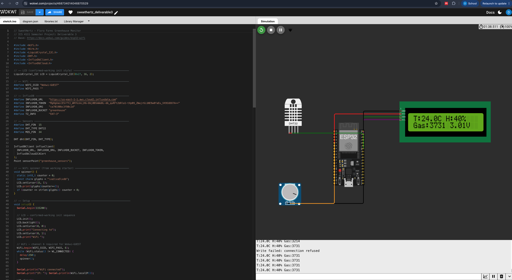
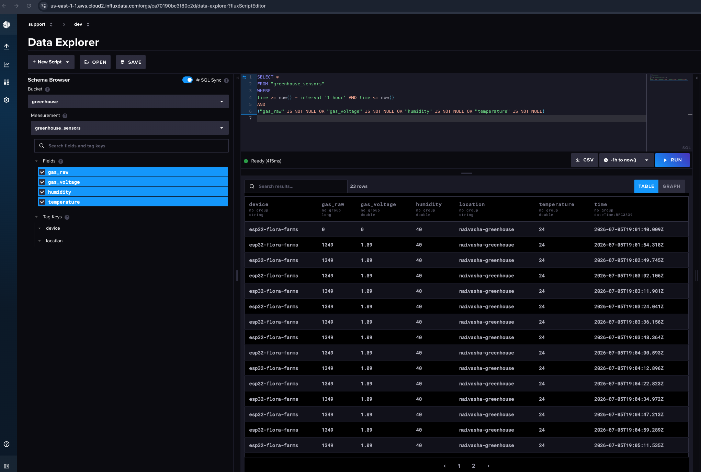
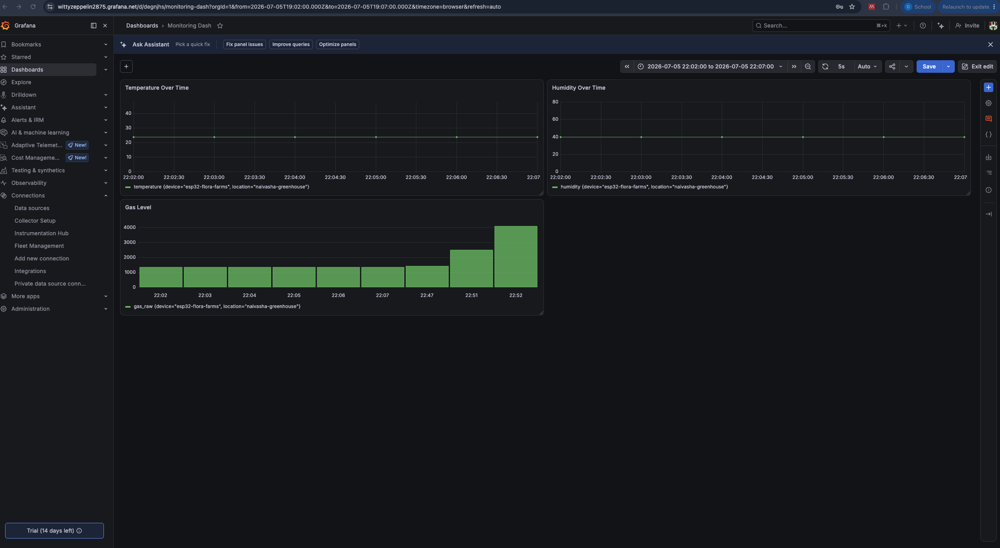

# ICS 4111: Embedded Systems & IoT
## Semester Project: Deliverable 3

**Objective:** Transmit and visualise sensor data on cloud platforms

**Group Name:** SweetHertz

| Student                  | Admission No. |
|--------------------------|---------------|
| Njogorio Sharon Nyambura | 164110        |
| Jonyo Janny              | 166885        |
| Ogutu Cindy Atieno       | 158842        |
| Mukoma Dennis Murage     | 139360        |
| Kemoi Kristina Chebet    | 168652        |
| Mapelu Neema Naserian    | 150176        |

---

## Overview

This deliverable extends Architecture (a) from Deliverable 2 - **ESP32 + MQ-5 + DHT22 + LCD** - by adding cloud connectivity. The ESP32 connects over simulated WiFi (Wokwi-GUEST), reads sensor values every 10 seconds, and publishes them to **InfluxDB Cloud** (time-series storage) which is then visualised through a **Grafana** dashboard.

### System Architecture

```
[DHT22] ──┐
           ├──→ [ESP32] ──WiFi──→ [InfluxDB Cloud] ──→ [Grafana Dashboard]
[MQ-5]  ──┘        │
                  [LCD]
```

---

## 1. Wokwi Simulation

### Circuit Description

| Component | Role | Connection |
|-----------|------|------------|
| ESP32 DevKit V1 | Microcontroller | - |
| DHT22 | Temperature & humidity sensor | GPIO 15 |
| Potentiometer (MQ-5 simulated) | Gas level (analog) | GPIO 34 |
| LCD 16 × 2 I2C | Local display | GPIO 21 (SDA), GPIO 22 (SCL), addr 0x27 |

> **Note:** Wokwi does not have a native MQ-5 component. A potentiometer is used to simulate the analog output of the gas sensor, which can be swept from 0 V to 3.3 V to represent varying gas concentrations.

### Simulation Link

**Wokwi Project:** [https://wokwi.com/projects/468734014046870529](https://wokwi.com/projects/468734014046870529)

### Simulation Screenshot



---

## 2. Firmware

The firmware for the simulation is stored in [`deliverable3/wokwi-web/sketch.ino`](deliverable3/wokwi-web/sketch.ino), with the corresponding circuit definition in [`deliverable3/wokwi-web/diagram.json`](deliverable3/wokwi-web/diagram.json) and library list in [`deliverable3/wokwi-web/libraries.txt`](deliverable3/wokwi-web/libraries.txt). The project configuration is provided in [`deliverable3/platformio.ini`](deliverable3/platformio.ini).

### Firmware Operation

1. **Boot sequence** - initialises LCD, DHT22, connects to `Wokwi-GUEST` WiFi, syncs NTP time, validates InfluxDB connection.
2. **Sensor loop** - reads DHT22 (temperature & humidity) and MQ-5 analog value every 2 seconds; displays live readings on the LCD.
3. **Cloud publish** - every 10 seconds, writes the sensor readings to InfluxDB Cloud over HTTPS for time-series storage and later visualisation in Grafana.

The firmware therefore performs local sensing, on-device display, wireless transmission, and cloud logging within a single ESP32-based monitoring node.

---

## 3. InfluxDB Cloud - Data Storage

The simulation was connected to the `greenhouse` bucket in InfluxDB Cloud, where all readings from the `greenhouse_sensors` measurement were stored as time-series data.

### Stored Data

The following fields are written to the `greenhouse_sensors` measurement on every publish cycle:

| Field | Unit | Description |
|-------|------|-------------|
| `temperature` | °C | DHT22 ambient temperature |
| `humidity` | % RH | DHT22 relative humidity |
| `gas_raw` | ADC count (0–4095) | MQ-5 raw 12-bit ADC reading |
| `gas_voltage` | V | MQ-5 voltage derived from ADC reading |

### Screenshot - InfluxDB Data Explorer



---

## 4. Grafana - Data Visualisation

Grafana was connected to the same InfluxDB bucket and used to create dashboard panels for temperature, humidity, and gas readings over time.

### Dashboard Panels

The Grafana dashboard was designed to track the main greenhouse variables over time and to relate them to the environmental ranges identified for daisy growth in Deliverable 1.

| Panel | Visualisation | Purpose |
|-------|---------------|---------|
| Temperature Over Time | Line chart | Shows how greenhouse temperature changes over time and whether it remains within the desirable 15 – 24 °C range. |
| Humidity Over Time | Line chart | Tracks relative humidity trends and helps identify whether the environment remains near the target 40 – 60% RH range. |
| Gas Level Over Time | Bar chart/time series | Displays the changing analog MQ-5 reading, indicating variation in simulated gas concentration levels. |

### Dashboard Screenshots



### Public Dashboard Link

**Grafana Dashboard:** [https://wittyzeppelin2875.grafana.net/goto/s8b8wt?orgId=stacks-1713913](https://wittyzeppelin2875.grafana.net/goto/s8b8wt?orgId=stacks-1713913)

---

## 5. Physical Implementation (Attempt) 

Despite **consistent hardware troubles,** we attempted the **physical implementation** as well. 

| | |
|---|---|
|  |  | 

---

## 6. Group Work Evidence


