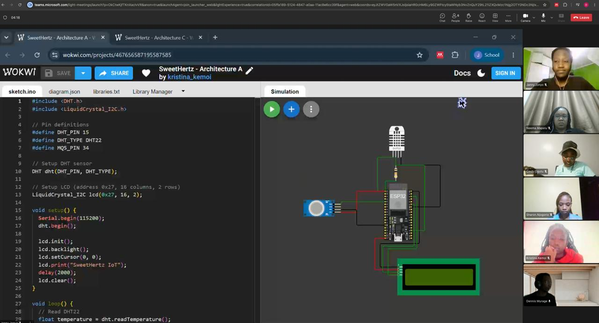

# ICS 4111: Embedded Systems & IoT
## Semester Project: Deliverable 3

**Objective:** Transmit and visualise sensor data on cloud platforms

**Group Name:** SweetHertz

| Student                  | Admission No. |
|--------------------------|---------------|
| Njogorio Sharon Nyambura | 164110        |
| Jonyo Janny              | 166885        |
| Ogutu Cindy Atieno       | 158842        |
| Mukoma Dennis Murage     | 139360        |
| Kemoi Kristina Chebet    | 168652        |
| Mapelu Neema Naserian    | 150176        |

---

## Overview

This deliverable extends Architecture (a) from Deliverable 2 — **ESP32 + MQ-5 + DHT22 + LCD** — by adding cloud connectivity. The ESP32 connects over simulated WiFi (Wokwi-GUEST), reads sensor values every 10 seconds, and publishes them to **InfluxDB Cloud** (time-series storage) which is then visualised through a **Grafana** dashboard.

### System Architecture

```
[DHT22] ──┐
           ├──→ [ESP32] ──WiFi──→ [InfluxDB Cloud] ──→ [Grafana Dashboard]
[MQ-5]  ──┘        │
                  [LCD]
```

---

## 1. Wokwi Simulation

### Circuit Description

| Component | Role | Connection |
|-----------|------|------------|
| ESP32 DevKit V1 | Microcontroller | — |
| DHT22 | Temperature & humidity sensor | GPIO 15 |
| Potentiometer (MQ-5 simulated) | Gas level (analog) | GPIO 34 |
| LCD 16×2 I2C | Local display | GPIO 21 (SDA), GPIO 22 (SCL), addr 0x27 |

> **Note:** Wokwi does not have a native MQ-5 component. A potentiometer is used to simulate the analog output of the gas sensor, which can be swept from 0 V to 3.3 V to represent varying gas concentrations.

### Simulation Link

**Wokwi Project:** [https://wokwi.com/projects/468734014046870529](https://wokwi.com/projects/468734014046870529)

<!-- To publish: open the project in Wokwi, click Share → make public, copy the link -->

### Simulation Screenshot

<!-- Add a screenshot of the running Wokwi simulation here -->
<!-- e.g.:  -->

---

## 2. Firmware

The browser Wokwi project files are stored in [`deliverable3/wokwi-web/sketch.ino`](deliverable3/wokwi-web/sketch.ino), [`deliverable3/wokwi-web/diagram.json`](deliverable3/wokwi-web/diagram.json), and [`deliverable3/wokwi-web/libraries.txt`](deliverable3/wokwi-web/libraries.txt). A matching PlatformIO copy is also kept in [`deliverable3/src/main.cpp`](deliverable3/src/main.cpp) for local builds with [`deliverable3/platformio.ini`](deliverable3/platformio.ini).

### Key logic

1. **Boot sequence** — initialises LCD, DHT22, connects to `Wokwi-GUEST` WiFi, syncs NTP time, validates InfluxDB connection.
2. **Sensor loop** — reads DHT22 (temperature & humidity) and MQ-5 analog value every 2 seconds; displays live readings on the LCD.
3. **Cloud publish** — every 10 seconds, writes a data point to InfluxDB using the **line protocol** over HTTPS:

```
greenhouse_sensors,device=esp32-flora-farms,location=naivasha-greenhouse
  temperature=23.50,humidity=55.00,gas_raw=2048,gas_voltage=1.650
```

### InfluxDB credentials (fill in before running)

Open [`deliverable3/wokwi-web/sketch.ino`](deliverable3/wokwi-web/sketch.ino) and update these four `#define` values at the top of the file:

```cpp
#define INFLUXDB_URL    "https://us-east-1-1.aws.cloud2.influxdata.com"
#define INFLUXDB_TOKEN  "YOUR_INFLUXDB_API_TOKEN"   // replace with your token
#define INFLUXDB_ORG    "ca70190bc3f80c2d"
#define INFLUXDB_BUCKET "greenhouse"
```

---

## 3. InfluxDB Cloud — Data Storage

The simulation was connected to the `greenhouse` bucket in InfluxDB Cloud, where all readings from the `greenhouse_sensors` measurement were stored as time-series data.

### Stored Data

The following fields are written to the `greenhouse_sensors` measurement on every publish cycle:

| Field | Unit | Description |
|-------|------|-------------|
| `temperature` | °C | DHT22 ambient temperature |
| `humidity` | % RH | DHT22 relative humidity |
| `gas_raw` | ADC count (0–4095) | MQ-5 raw 12-bit ADC reading |
| `gas_voltage` | V | MQ-5 voltage derived from ADC reading |

### Screenshot — InfluxDB Data Explorer


---

## 4. Grafana — Data Visualisation

Grafana was connected to the same InfluxDB bucket and used to create dashboard panels for temperature, humidity, and gas readings over time.

### Dashboard Panels

#### Panel 1 — Temperature Over Time (Line Chart)

**Flux query:**

```flux
from(bucket: "greenhouse")
  |> range(start: -1h)
  |> filter(fn: (r) => r._measurement == "greenhouse_sensors" and r._field == "temperature")
  |> aggregateWindow(every: 1m, fn: mean, createEmpty: false)
```

> Displays how greenhouse temperature trends over the past hour. The optimal range for daisy growth (15–24 °C) is marked with threshold lines.

#### Panel 2 — Humidity Over Time (Line Chart)

**Flux query:**

```flux
from(bucket: "greenhouse")
  |> range(start: -1h)
  |> filter(fn: (r) => r._measurement == "greenhouse_sensors" and r._field == "humidity")
  |> aggregateWindow(every: 1m, fn: mean, createEmpty: false)
```

> Shows relative humidity trends. Threshold lines at 40% and 60% highlight the optimal daisy growth range.

#### Panel 3 — Gas Level Over Time (Bar Chart / Time Series)

**Flux query:**

```flux
from(bucket: "greenhouse")
  |> range(start: -1h)
  |> filter(fn: (r) => r._measurement == "greenhouse_sensors" and r._field == "gas_raw")
  |> aggregateWindow(every: 1m, fn: max, createEmpty: false)
```

> Plots peak MQ-5 ADC readings per minute, indicating gas concentration trends in the greenhouse environment.

### Dashboard Screenshots

<!-- Replace with your actual Grafana screenshots once the dashboard is live -->
<!--  -->
<!--  -->
<!--  -->
<!--  -->

### Public Dashboard Link

<!-- Grafana Cloud → Share → Make public → paste link here -->
**Grafana Dashboard:** [_Add public Grafana link here_]

---

## 5. Group Work Evidence

<!-- Add a group photo here. Example: -->
<!--  -->

The team collaborated on this deliverable as follows:

| Member | Contribution |
|--------|-------------|
| Njogorio Sharon Nyambura | InfluxDB Cloud setup and bucket configuration |
| Jonyo Janny | Grafana data source setup and dashboard panels |
| Ogutu Cindy Atieno | Firmware coding (cloud publish logic) |
| Mukoma Dennis Murage | PlatformIO + Wokwi project setup |
| Kemoi Kristina Chebet | Testing, serial monitor verification |
| Mapelu Neema Naserian | Documentation and Markdown submission |


